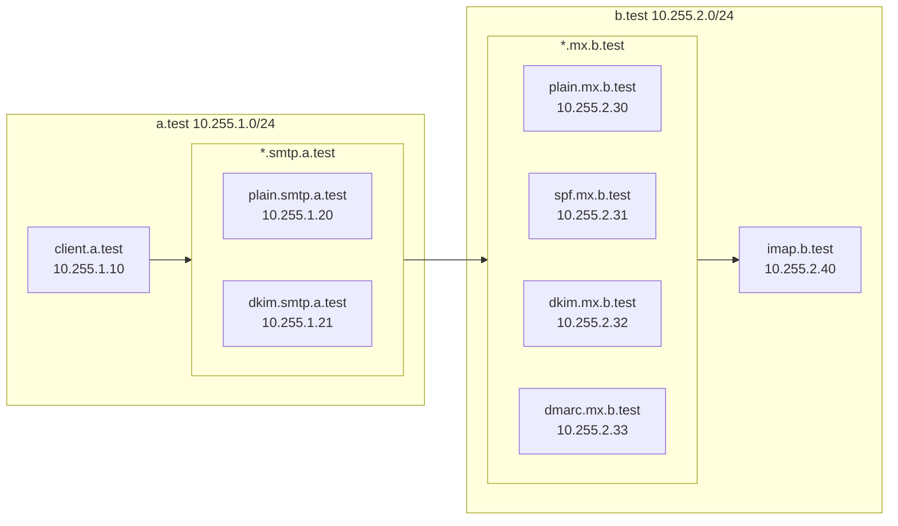

# SMTP本(仮称)

## 初期設定

### ネットワークの指定

compose.yaml は、 `/16` のネットワークを作成します。対象のネットワークを、 `.env` ファイルで指定してください。デフォルトでは、 `10.255.0.0/16` を示す `NETWORK=10.255` が設定されています。

尚、 `.env` ファイルを更新した場合は、後述の `make build` を再度行ってください。

### イメージのビルド

イメージの作成のため、一度だけ、以下のコマンドを実行してください。

```
make build
```

## 起動方法

以下のコマンドを実行すると、全てのコンテナが起動します。

```
make up
```

## ネットワーク構成

make up を実行すると、以下の図のネットワークが構成されます。この環境を元に、 a.test から b.test へのメール送信を行います。



### a.test


サーバ名 | IP | 備考
-: | :- | :-
client.a.test     | .1.10  | メール送信テスト用のスクリプトが配置されています。
plain.smtp.a.test | .1.20 | 署名を行わないSMTPサーバ。
dkim.smtp.a.test  | .1.21 | DKIM署名を行うSMTPサーバ。セレクタは `smtpbook`。

また、以下のTXTレコードを設定しています。

ドメイン | レコード 
-: | :-
a.test                     |  `"v=spf1 ip4:_NETWORK.1.30/31 -all"` 
fail.a.test                |  `"v=spf1 ip4:_NETWORK.255.30/31 -all"` 
smtpbook._domainkey.a.test |  `"v=DKIM1; k=rsa; " "p=MIIBIjAN(省略)QIDAQAB"`
_dmarc.a.test              |  `"v=DMARC1; p=quarantine; pct=100"`


### b.test

サーバ名 | IP | 備考
-: | :- | :-
plain.mx.b.test  | .1.30 | 検証を行わない
spf.mx.b.test    | .1.31 | SPFの検証を行う
dkim.mx.b.test   | .1.32 | DKIM署名の検証を行う
dmarc.mx.b.test  | .1.33 | SPF/DKIM/DMARCの検証を行う
imap.b.test      | .1.40 | *.mx.b.test へのメールは、全てこのサーバにリレーされる

## 実行例

以下のようなコマンドを実行すると、それぞれのメール送信の様子を見ることができます。

```bash
make build
make up
make scenario6/send
make view
```

### 実行ログの例

`make scenario[1-9]/send` を実行すると、 `a-client` コンテナに設置されている `/example/send.sh` が実行され、指定したFrom、Toを元に、SMTPサーバに `telnet` コマンドでSMTP通信を行う様子が確認できます。 

```
$ make scenario6/send 
docker compose exec a-client /send.sh user1@a.test    user1@dmarc.b.test scenario6 dkim.smtp.a.test
# telnet dkim.smtp.a.test 25
--------------------------
Trying 10.255.1.21...
Connected to dkim.smtp.a.test.
Escape character is '^]'.
220 dkim.smtp.a.test ESMTP Postfix
HELO a.test
250 dkim.smtp.a.test
MAIL FROM: user1@a.test
250 2.1.0 Ok
RCPT TO:   user1@dmarc.b.test
250 2.1.5 Ok
DATA
354 End data with <CR><LF>.<CR><LF>
Message-ID: <20241110123038.19624@a.test>
Date: Sun, 10 Nov 2024 12:30:38 +0900
From: user1@a.test
To:   user1@dmarc.b.test
Subject: scenario6 (mail from user1@a.test)

Hello user1@dmarc.b.test!
.
250 2.0.0 Ok: queued as 396E73840F1
QUIT
Connection closed by foreign host.
--------------------------
```

`make view` を実行すると、 `user1@b.test` へ送信された最新のメールを確認することができます。

※ POP3 接続や IMAP 接続は行わないため、表示した対象のメールは `cur/` への移動は行われません。

```
$ make view 
docker compose exec b-imap /view.sh user1
--------------------------
Return-Path: <user1@a.test>
X-Original-To: user1@dmarc.b.test
Delivered-To: user1@dmarc.b.test
Received: from dmarc.mx.b.test (dmarc.mx.b.test [10.255.2.33])
        by imap.b.test (Postfix) with ESMTPS id 94F133840F1
        for <user1@dmarc.b.test>; Sun, 10 Nov 2024 12:30:39 +0900 (JST)
Received: from dkim.smtp.a.test (dkim.smtp.a.test [10.255.1.21])
        by dmarc.mx.b.test (Postfix) with ESMTPS id 5A5473840F9
        for <user1@dmarc.b.test>; Sun, 10 Nov 2024 12:30:39 +0900 (JST)
Authentication-Results: dmarc.mx.b.test;
        dkim=pass header.d=a.test header.s=smtpbook header.b=Uhayoaz1;
        spf=pass (dmarc.mx.b.test: domain of user1@a.test designates 10.255.1.21 as permitted sender) smtp.mailfrom=user1@a.test;
        dmarc=pass (policy=quarantine) header.from=a.test
Received: from a.test (client.a.test [10.255.1.10])
        by dkim.smtp.a.test (Postfix) with SMTP id 396E73840F1
        for <user1@dmarc.b.test>; Sun, 10 Nov 2024 12:30:38 +0900 (JST)
DKIM-Signature: v=1; a=rsa-sha256; c=relaxed/relaxed; d=a.test; s=smtpbook;
        t=1731209439;
        h=from:from:reply-to:subject:subject:date:date:message-id:message-id:
         to:to:cc; bh=4O5lFigIhxLU8If/5QjKchggSnc7Yxld80E41+l39XE=;
        b=Uhayoaz1mxKEBVSu0O5JFHjZbu/3m65uDlf1azcOrNkX7oRc8U4o1F7DrX+ChFwlJ3tpCx
        XmXflGmBbQ5yFo9qMzhxhs9W6pzt90WY/qfwp4ryj5DRPtgGFLc6g4mCpxw5FgYPr/FH2y
        yTQJ6T4F8f5BnkbKlKx5YzV1M3XSRbHrQZ3tVxEtRUfopj/ocw0wipY1Fx4Y9nyI7hdgB6
        gfe4dPwN6BLeJebK1QYogpaVp6VwKSyycKk33MWETEAH1XWg74+Lzln0se2yICEgf/Kb+R
        /5IYKirGQc8c3kzCqU+hORdlX4Xq+tsefmvWz2LWPQJ1l3Ukh4WDRDWy1lR0WA==
Message-ID: <20241110123038.19624@a.test>
Date: Sun, 10 Nov 2024 12:30:38 +0900
From: user1@a.test
To:   user1@dmarc.b.test
Subject: scenario6 (mail from user1@a.test)

Hello user1@dmarc.b.test!
--------------------------
```

## 補足: docker compose の出力について

`make scenario[1-9]/send` を実行すると、 `docker compose` の標準出力からDNSの問い合わせやpostfixのログを確認することができます。（※例示のグは順番を整形済み）

メールのヘッダーだけでなく、DNSへの問い合わせ、postfixのログから、さらに理解を深められるようにできています。

```
dns           | Nov 10 12:30:37 unbound[6:0] info: 10.255.1.10 dkim.smtp.a.test. AAAA IN
dns           | Nov 10 12:30:37 unbound[6:0] info: 10.255.1.10 dkim.smtp.a.test. A IN
dns           | Nov 10 12:30:37 unbound[6:0] info: 10.255.1.21 10.1.255.10.in-addr.arpa. PTR IN
dns           | Nov 10 12:30:37 unbound[6:0] info: 10.255.1.21 client.a.test. A IN
dns           | Nov 10 12:30:37 unbound[6:0] info: 10.255.1.21 localhost. A IN
dns           | Nov 10 12:30:39 unbound[6:0] info: 10.255.1.21 dmarc.b.test. MX IN
dns           | Nov 10 12:30:39 unbound[6:0] info: 10.255.1.21 dmarc.mx.b.test. A IN
dns           | Nov 10 12:30:39 unbound[6:0] info: 10.255.2.33 21.1.255.10.in-addr.arpa. PTR IN
dns           | Nov 10 12:30:39 unbound[6:0] info: 10.255.2.33 dkim.smtp.a.test. A IN
dns           | Nov 10 12:30:39 unbound[6:0] info: 10.255.2.33 localhost. A IN
dns           | Nov 10 12:30:39 unbound[6:0] info: 10.255.2.33 a.test. TXT IN
dns           | Nov 10 12:30:39 unbound[6:0] info: 10.255.2.33 smtpbook._domainkey.a.test. TXT IN
dns           | Nov 10 12:30:39 unbound[6:0] info: 10.255.2.33 _dmarc.a.test. TXT IN
dns           | Nov 10 12:30:39 unbound[6:0] info: 10.255.2.33 imap.b.test. MX IN
dns           | Nov 10 12:30:39 unbound[6:0] info: 10.255.2.33 imap.b.test. A IN
dns           | Nov 10 12:30:39 unbound[6:0] info: 10.255.2.40 33.2.255.10.in-addr.arpa. PTR IN
dns           | Nov 10 12:30:39 unbound[6:0] info: 10.255.2.40 dmarc.mx.b.test. A IN
a-smtp-dkim   | Nov 10 12:30:37 dkim postfix/smtpd[108]: connect from client.a.test[10.255.1.10]
a-smtp-dkim   | Nov 10 12:30:38 dkim postfix/smtpd[108]: 396E73840F1: client=client.a.test[10.255.1.10]
a-smtp-dkim   | Nov 10 12:30:39 dkim postfix/cleanup[112]: 396E73840F1: message-id=<20241110123038.19624@a.test>
a-smtp-dkim   | Nov 10 12:30:39 dkim postfix/qmgr[105]: 396E73840F1: from=<user1@a.test>, size=412, nrcpt=1 (queue active)
a-smtp-dkim   | Nov 10 12:30:39 dkim postfix/smtpd[108]: disconnect from client.a.test[10.255.1.10] helo=1 mail=1 rcpt=1 data=1 quit=1 commands=5
a-smtp-dkim   | Nov 10 12:30:39 dkim postfix/smtp[113]: 396E73840F1: to=<user1@dmarc.b.test>, relay=dmarc.mx.b.test[10.255.2.33]:25, delay=1.4, delays=1.1/0.02/0.05/0.17, dsn=2.0.0, status=sent (250 2.0.0 Ok: queued as 5A5473840F9)
a-smtp-dkim   | Nov 10 12:30:39 dkim postfix/qmgr[105]: 396E73840F1: removed
b-mx-dmarc    | Nov 10 12:30:39 dmarc postfix/smtpd[108]: connect from dkim.smtp.a.test[10.255.1.21]
b-mx-dmarc    | Nov 10 12:30:39 dmarc postfix/smtpd[108]: 5A5473840F9: client=dkim.smtp.a.test[10.255.1.21]
b-mx-dmarc    | Nov 10 12:30:39 dmarc postfix/cleanup[112]: 5A5473840F9: message-id=<20241110123038.19624@a.test>
b-mx-dmarc    | Nov 10 12:30:39 dmarc postfix/qmgr[106]: 5A5473840F9: from=<user1@a.test>, size=1190, nrcpt=1 (queue active)
b-mx-dmarc    | Nov 10 12:30:39 dmarc postfix/smtpd[108]: disconnect from dkim.smtp.a.test[10.255.1.21] ehlo=2 starttls=1 mail=1 rcpt=1 data=1 quit=1 commands=7
b-mx-dmarc    | Nov 10 12:30:39 dmarc postfix/smtp[113]: 5A5473840F9: to=<user1@dmarc.b.test>, relay=imap.b.test[10.255.2.40]:25, delay=0.25, delays=0.16/0.02/0.05/0.02, dsn=2.0.0, status=sent (250 2.0.0 Ok: queued as 94F133840F1)
b-mx-dmarc    | Nov 10 12:30:39 dmarc postfix/qmgr[106]: 5A5473840F9: removed
b-imap        | Nov 10 12:30:39 imap postfix/smtpd[99]: connect from dmarc.mx.b.test[10.255.2.33]
b-imap        | Nov 10 12:30:39 imap postfix/smtpd[99]: 94F133840F1: client=dmarc.mx.b.test[10.255.2.33]
b-imap        | Nov 10 12:30:39 imap postfix/cleanup[103]: 94F133840F1: message-id=<20241110123038.19624@a.test>
b-imap        | Nov 10 12:30:39 imap postfix/smtpd[99]: disconnect from dmarc.mx.b.test[10.255.2.33] ehlo=2 starttls=1 mail=1 rcpt=1 data=1 quit=1 commands=7
b-imap        | Nov 10 12:30:39 imap postfix/qmgr[97]: 94F133840F1: from=<user1@a.test>, size=1623, nrcpt=1 (queue active)
b-imap        | Nov 10 12:30:39 imap postfix/local[104]: 94F133840F1: to=<user1@dmarc.b.test>, relay=local, delay=0.02, delays=0.01/0.01/0/0, dsn=2.0.0, status=sent (delivered to maildir)
b-imap        | Nov 10 12:30:39 imap postfix/qmgr[97]: 94F133840F1: removed
```
