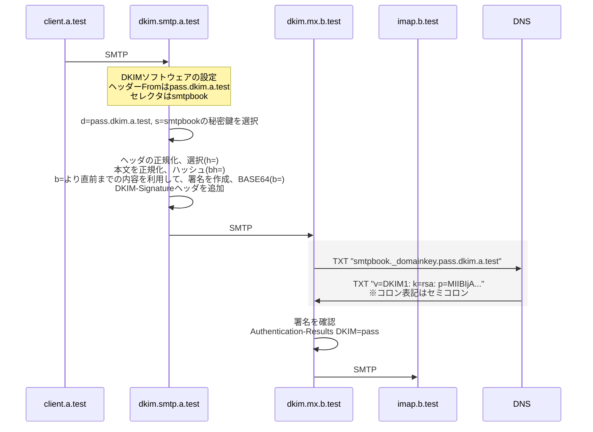

```mermaid
sequenceDiagram
    participant client as client.a.test
    participant smtp   as dkim.smtp.a.test
    participant mx     as dkim.mx.b.test
    participant imap   as imap.b.test
    participant dns    as DNS

    client  ->> smtp : SMTP
    note over smtp: DKIMソフトウェアの設定<br>ヘッダーFromはpass.dkim.a.test<br>セレクタはsmtpbook
    smtp   ->> smtp : d=pass.dkim.a.test, s=smtpbookの秘密鍵を選択
    smtp   ->> smtp : ヘッダの正規化、選択(h=)<br>本文を正規化、ハッシュ(bh=)<br>b=より直前までの内容を利用して、署名を作成、BASE64(b=)<br>DKIM-Signatureヘッダを追加
    smtp    ->> mx   : SMTP
    rect rgb(244, 244, 244)
        mx      ->> dns  : TXT "smtpbook._domainkey.pass.dkim.a.test"
        dns     ->> mx   : TXT "v=DKIM1: k=rsa: p=MIIBIjA..."<br>※コロン表記はセミコロン
    end
    mx      ->> mx     : 署名を確認<br>Authentication-Results DKIM=pass
    mx      ->> imap   : SMTP
```
