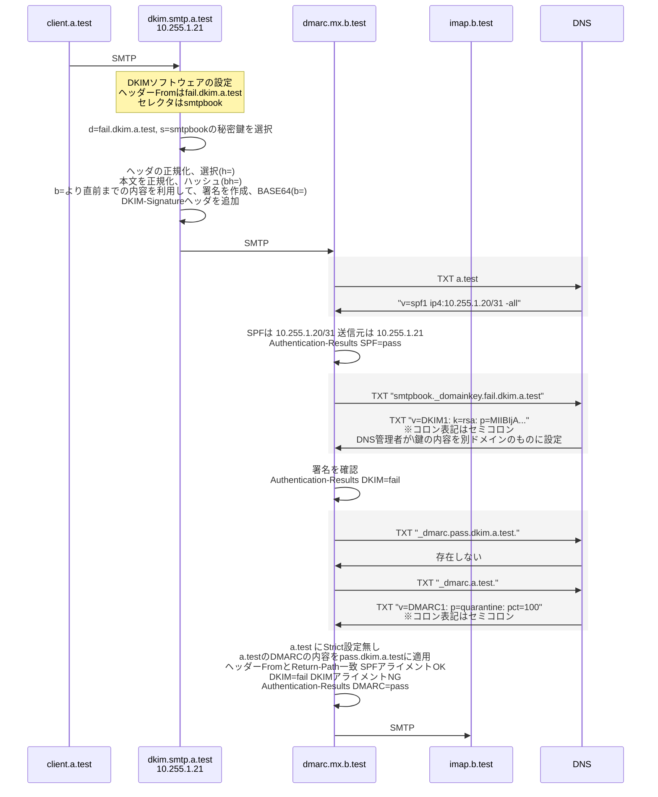

```mermaid
sequenceDiagram
    participant client as client.a.test
    participant smtp   as dkim.smtp.a.test<br>10.255.1.21
    participant mx     as dmarc.mx.b.test
    participant imap   as imap.b.test
    participant dns    as DNS

    client  ->> smtp : SMTP
    note over smtp: DKIMソフトウェアの設定<br>ヘッダーFromはfail.dkim.a.test<br>セレクタはsmtpbook
    smtp   ->> smtp : d=fail.dkim.a.test, s=smtpbookの秘密鍵を選択
    smtp   ->> smtp : ヘッダの正規化、選択(h=)<br>本文を正規化、ハッシュ(bh=)<br>b=より直前までの内容を利用して、署名を作成、BASE64(b=)<br>DKIM-Signatureヘッダを追加
    smtp    ->> mx   : SMTP
    rect rgb(244, 244, 244)
        mx      ->> dns  : TXT a.test
        dns     ->> mx   : "v=spf1 ip4:10.255.1.20/31 -all"
    end
    mx      ->> mx     : SPFは 10.255.1.20/31 送信元は 10.255.1.21<br>Authentication-Results SPF=pass
    rect rgb(244, 244, 244)
        mx      ->> dns  : TXT "smtpbook._domainkey.fail.dkim.a.test"
        dns     ->> mx   : TXT "v=DKIM1: k=rsa: p=MIIBIjA..."<br>※コロン表記はセミコロン<br>DNS管理者が\鍵の内容を別ドメインのものに設定
    end
    mx      ->> mx     : 署名を確認<br>Authentication-Results DKIM=fail
    rect rgb(244, 244, 244)
        mx      ->> dns  : TXT "_dmarc.pass.dkim.a.test."
        dns     ->> mx   : 存在しない
        mx      ->> dns  : TXT "_dmarc.a.test."
        dns     ->> mx   : TXT "v=DMARC1: p=quarantine: pct=100"<br>※コロン表記はセミコロン
    end
     mx      ->> mx    : a.test にStrict設定無し<br>a.testのDMARCの内容をpass.dkim.a.testに適用<br>ヘッダーFromとReturn-Path一致 SPFアライメントOK<br>DKIM=fail DKIMアライメントNG<br>Authentication-Results DMARC=pass
    mx      ->> imap   : SMTP
```
