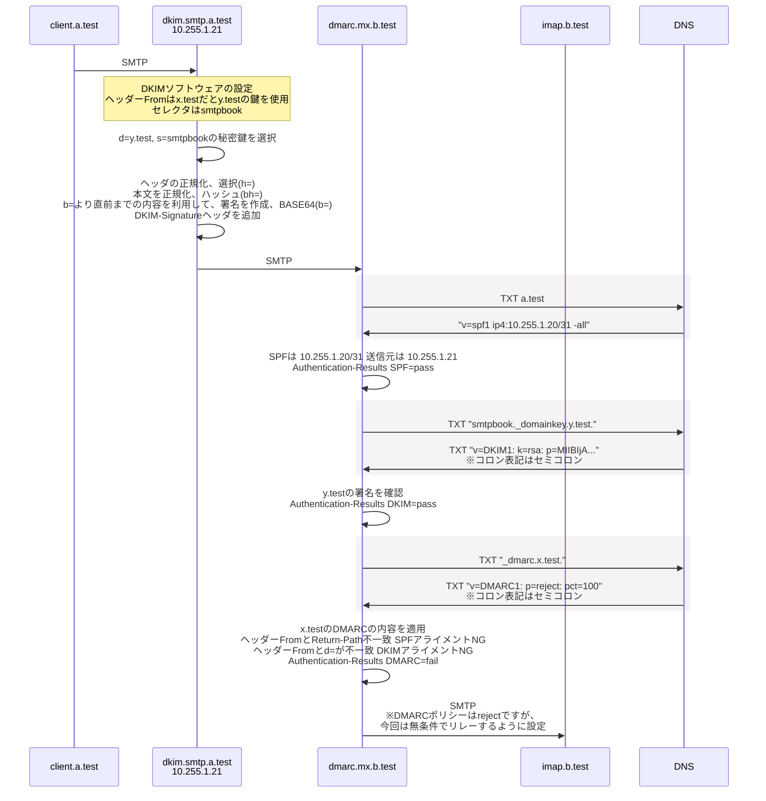

```mermaid
sequenceDiagram
    participant client as client.a.test
    participant smtp   as dkim.smtp.a.test<br>10.255.1.21
    participant mx     as dmarc.mx.b.test
    participant imap   as imap.b.test
    participant dns    as DNS

    client  ->> smtp : SMTP
    note over smtp: DKIMソフトウェアの設定<br>ヘッダーFromはx.testだとy.testの鍵を使用<br>セレクタはsmtpbook
    smtp   ->> smtp : d=y.test, s=smtpbookの秘密鍵を選択
    smtp   ->> smtp : ヘッダの正規化、選択(h=)<br>本文を正規化、ハッシュ(bh=)<br>b=より直前までの内容を利用して、署名を作成、BASE64(b=)<br>DKIM-Signatureヘッダを追加
    smtp    ->> mx   : SMTP
    rect rgb(244, 244, 244)
        mx      ->> dns  : TXT a.test
        dns     ->> mx   : "v=spf1 ip4:10.255.1.20/31 -all"
    end
    mx      ->> mx     : SPFは 10.255.1.20/31 送信元は 10.255.1.21<br>Authentication-Results SPF=pass
    rect rgb(244, 244, 244)
        mx      ->> dns  : TXT "smtpbook._domainkey.y.test."
        dns     ->> mx   : TXT "v=DKIM1: k=rsa: p=MIIBIjA..."<br>※コロン表記はセミコロン
    end
    mx      ->> mx     : y.testの署名を確認<br>Authentication-Results DKIM=pass
    rect rgb(244, 244, 244)
        mx      ->> dns  : TXT "_dmarc.x.test."
        dns     ->> mx   : TXT "v=DMARC1: p=reject: pct=100"<br>※コロン表記はセミコロン
    end
     mx      ->> mx    : x.testのDMARCの内容を適用<br>ヘッダーFromとReturn-Path不一致 SPFアライメントNG<br>ヘッダーFromとd=が不一致 DKIMアライメントNG<br>Authentication-Results DMARC=fail
    mx      ->> imap   : SMTP<br>※DMARCポリシーはrejectですが、<br>今回は無条件でリレーするように設定
```
