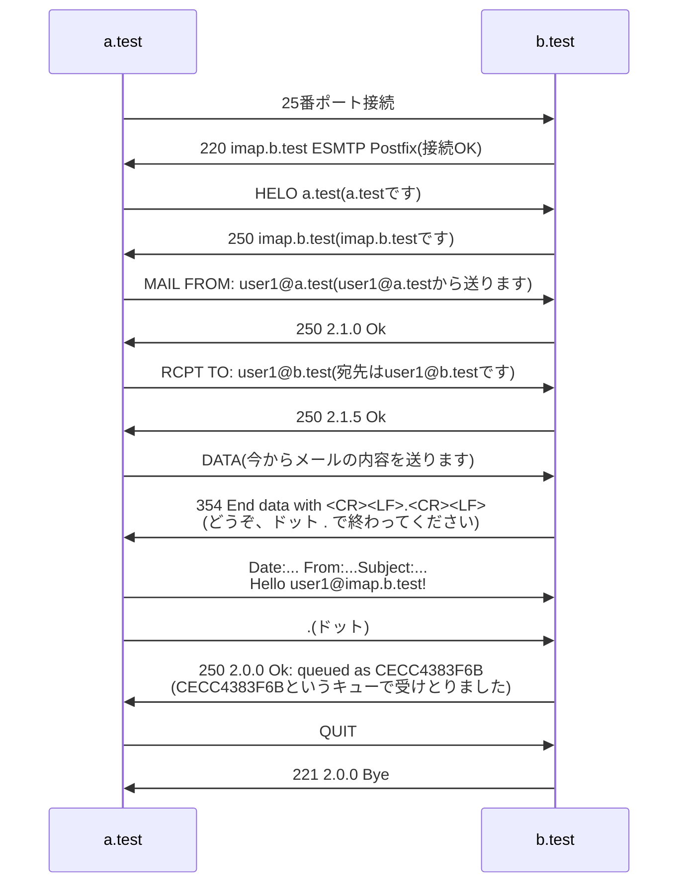

```mermaid
sequenceDiagram
    participant a as a.test
    participant b as b.test
    a  ->> b : 25番ポート接続
    b  ->> a : 220 imap.b.test ESMTP Postfix(接続OK)
    a  ->> b : HELO a.test(a.testです)
    b  ->> a : 250 imap.b.test(imap.b.testです)
    a  ->> b : MAIL FROM: user1@a.test(user1@a.testから送ります)
    b  ->> a : 250 2.1.0 Ok
    a  ->> b : RCPT TO:   user1@b.test(宛先はuser1@b.testです)
    b  ->> a : 250 2.1.5 Ok
    a  ->> b : DATA(今からメールの内容を送ります)
    b  ->> a : 354 End data with <CR><LF>.<CR><LF><br>(どうぞ、ドット . で終わってください)
    a  ->> b : Date:... From:...Subject:...<br>Hello user1@imap.b.test!
    a  ->> b : .(ドット)
    b  ->> a : 250 2.0.0 Ok: queued as CECC4383F6B<br>(CECC4383F6Bというキューで受けとりました)
    a  ->> b : QUIT
    b  ->> a : 221 2.0.0 Bye 
```
