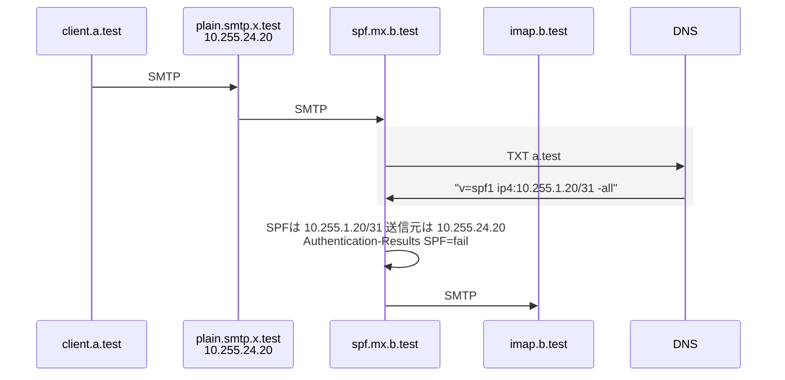

```mermaid
sequenceDiagram
    participant client as client.a.test
    participant smtp   as plain.smtp.x.test<br>10.255.24.20
    participant mx     as spf.mx.b.test
    participant imap   as imap.b.test
    participant dns    as DNS

    client  ->> smtp : SMTP
    smtp    ->> mx   : SMTP
    rect rgb(244, 244, 244)
        mx      ->> dns  : TXT a.test
        dns     ->> mx   : "v=spf1 ip4:10.255.1.20/31 -all"
    end
    mx      ->> mx     : SPFは 10.255.1.20/31 送信元は 10.255.24.20<br>Authentication-Results SPF=fail
    mx      ->> imap   : SMTP
```
